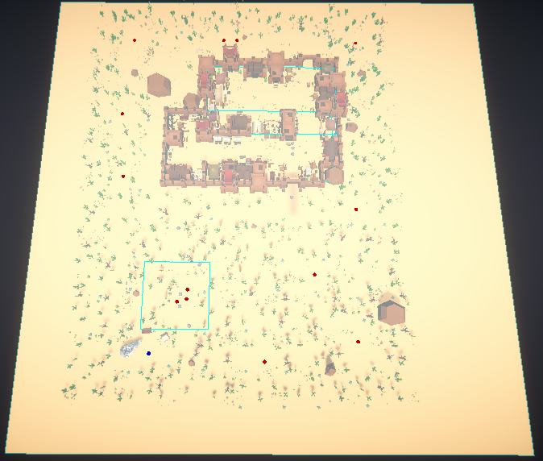
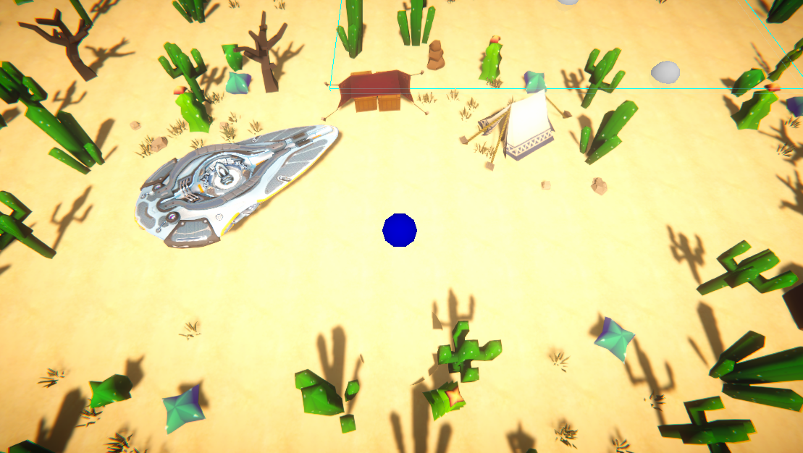
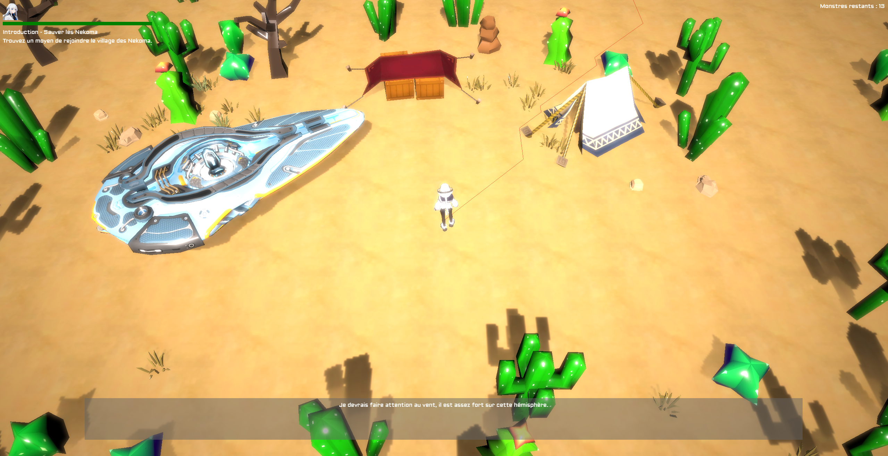
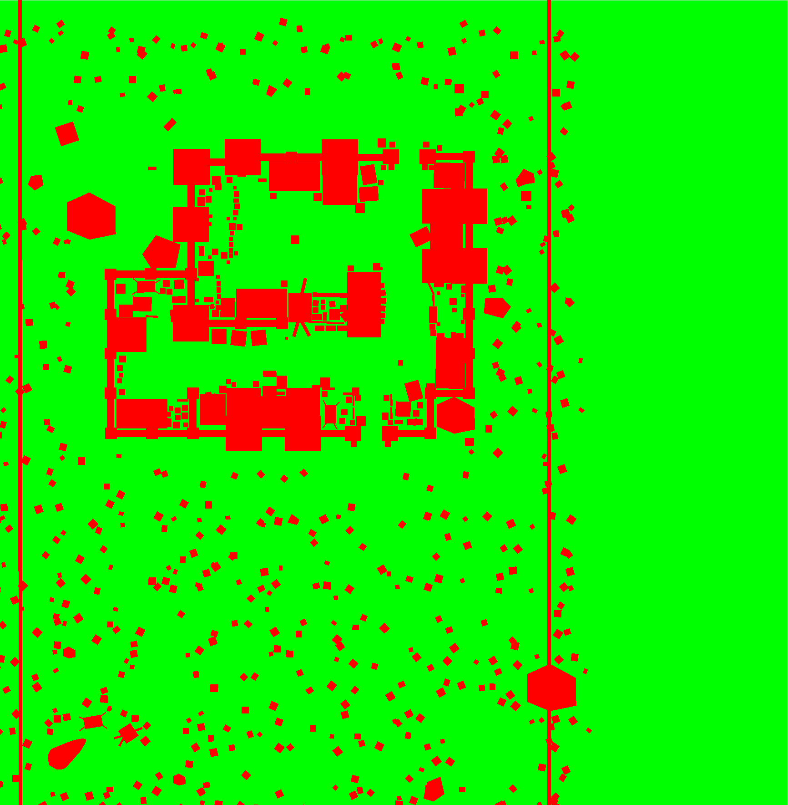

# Rendu final mineure programmation de jeux 3D sur le Web
Sébastien Aglaé & Mike Chiappe & Meriem Saez

## Installation
```bash
npm install
```

## Lancement
```bash
npm start
```

## Informations
Site web
[assets.atrasis.net/nakama/](https://assets.atrasis.net/nakama/index.html)  
La video de démonstration
https://assets.atrasis.net/nakama/video.mp4 / https://youtu.be/RS4b-6q4NmY  
Nom: Hana Games
- AGLAE Sebastien : Développement de la partie spatiale
- CHIAPPE Mike : Développement de la partie planète
- SAEZ Meriem : Aide sur les assets 2D/3D
Nous vous recommendons d'utiliser Google Chrome pour jouer au jeu car il supporte officiellement WebGPU ! Sinon, vous serez redirigé vers WebGl :(.
## Histoire

Dans le jeu Nakama, le joueur incarne Akane, une sergente de l'espace au courage inébranlable. Sa mission principale est de protéger les formes de vie extraterrestres des attaques et de préserver l'équilibre écologique des planètes.

Un jour, alors qu'Akane patrouille dans les confins de l'espace, elle reçoit un message radio urgent provenant de l'ECO Earth, sa planète d'origine. Le message fait état d'une série d'attaques menées par Astra Corp, une puissante civilisation intergalactique qui pille les ressources naturelles des planètes pour son propre bénéfice.

Informée que les planètes de la galaxie Eriko sont les cibles principales d'Astra Corp, Akane se lance immédiatement dans une course contre la montre pour empêcher le pillage de la planète Nakama, réputée pour abriter une biodiversité extraordinaire et des espèces extraterrestres uniques.

À son arrivée sur Nakama, Akane découvre une situation désespérée. Les forces d'Astra Corp ont déjà commencé à ravager la planète, capturant les créatures vivantes et détruisant impitoyablement l'environnement. Akane réalise que la survie de Nakama et de ses espèces dépend de sa capacité à coordonner une résistance et à mettre un terme à l'invasion.

Déterminée, Akane explore les différentes régions de Nakama, combattant les soldats d'Astra Corp et libérant les espèces emprisonnées. Elle se lie d'amitié avec certains des extraterrestres, appelés 'Nekoma', qui possèdent des capacités spéciales et se joignent à elle dans sa quête.

Au fur et à mesure de sa progression, Akane découvre les plans maléfiques d'Astra Corp. Ils projettent de détruire Nakama en utilisant une arme puissante, ce qui entraînerait la perte de cette planète unique et de toutes ses formes de vie. Akane se rend compte que la bataille pour Nakama est bien plus importante que la simple protection d'une seule planète. C'est un combat pour la préservation de la diversité et de la vie elle-même.

## Monde spatial
### Controles
#### Joueur
- Z: Avancer
- S: Reculer
- Q: Tourner à gauche
- D: Tourner à droite
- Clic sur la souris + bouger la souris: Tourner la caméra
#### Vaisseau
- Z: Monter
- S: Descendre
- Q: Tourner à gauche
- D: Tourner à droite
- Espace: Accélérer
- Shift: Ralentir
- E: Orienter le vaisseau vers la planète la plus proche
- Fleche du haut : Changer de planete
- Fleche du bas : Changer de planete
#### General
- Echap : Entrer dans le vaisseau (Triche)
- Entrer : Aller dans la base spatiale (Triche)

### Description
Akane vient de recevoir le message radio. Elle doit se rendre d'urgence sur la planète Nakama via son vaisseau.  
Vous, le joueur, va devoir trouver et piloter le vaisseau pour se rendre sur la planète Nakama.

### Autres
Le dashboard fait sous figma et exporté en utilisant le plugin figma to babylonjs
https://www.figma.com/file/VDfB4SOgeenDlYsY7d6GvQ/GOW2023?type=design&node-id=0%3A1&t=iU5WZSCvmMBcvUF2-1

## Planete
### Contrôles
Z: Avancer
S: Reculer
Q: Tourner à gauche
D: Tourner à droite
Clic gauche: Tirer vers l'endroit où le joueur vise

### Description
Akane vient d'arriver sur la planète Nakama. Elle doit maintenant explorer la planète et trouver les créatures qui y vivent.

### Autres
Le niveau a été entièrement fait sur Unity. Nous avons réalisé des packs d'assets et fait notre propre map avec.  
Nous avons développé notre propre système d'exportation permettant d'avoir approximativement le même rendu sur Unity et BabylonJS.  
Le jeu était prévu pour être un jeu de type RPG avec des crafts, des quêtes et des combats mais nous n'avons pas eu le temps de le finir complètement.

## Phase de développement
Le développement du jeu a été fait sur une semaine de notre temps libre + le temps alloué à la mineure de programmation de jeux 3D sur le Web.  
Nous avons rencontré plusieurs difficultés durant le développement du jeu ce qui nous a empêché de faire tout ce que nous voulions faire.  
Initialement, nous souhaitions faire un jeu de type RPG avec un système de combat et de quêtes. Le joueur aurait pu voyager entre 3 planètes différentes et aurait pu se battre contre des ennemis très variés sur le plan gameplay mais aussi sur le plan visuel. Même si le travail rendu n'est pas à la hauteur de nos attentes, nous sommes assez satisfait du résultat final et nous avons appris beaucoup de choses durant le développement du jeu.
Contrairement au jeu rendu lors du concours 2021, nous avons essayé de faire un jeu avec une durée de vie plus longue et plus de contenu. Nous avons aussi essayé de faire un jeu plus agréable à jouer et plus beau visuellement.


## Image de développement

*Level editor de la map sur Unity*


*Vue de la map sur Unity*


*Vue de la map sur BabylonJS*


*Vue des collisions générées en fonction des éléments de la map*